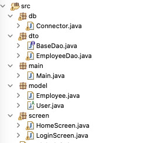

##Cài đặt
- Tải eclipse trên mac: https://www.eclipse.org/downloads/download.php?file=/technology/epp/downloads/release/2023-09/R/eclipse-java-2023-09-R-macosx-cocoa-aarch64.dmg
- Cài WindowBuilder để dựng GUI JFrame:https://blogchiasekienthuc.com/lap-trinh/cai-dat-plugin-windowbuilder-tren-eclipse.html
- Database sử dụng mysql (cấu hình trong Connector.java)

##Cấu trúc project:
 

- dto: chứa các class Dao được implements từ BaseDao để query tới database lấy dữ liệu 
- db: chứa class connector để kết nối tới database
- main: entrypoint của project. ứng dụng chạy sẽ vào đây đầu tiên
- model: chứa các class POJO xem như là entity từ database
- screen: các class JFrame. Là các màn hình

